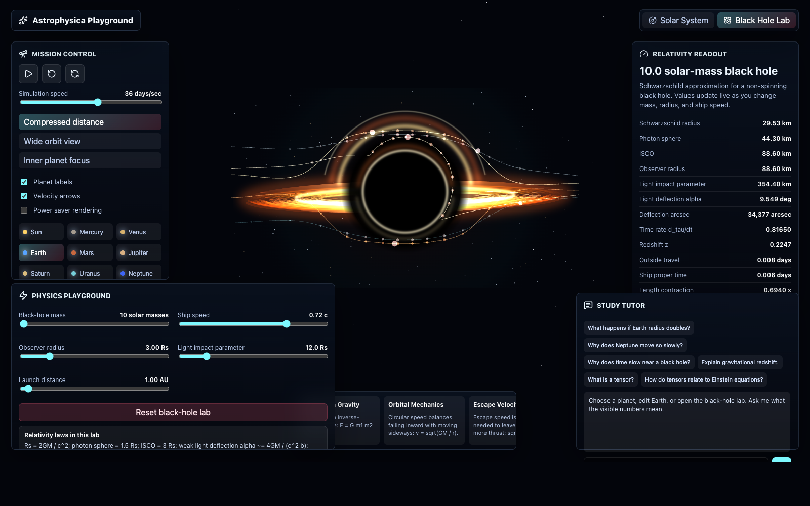
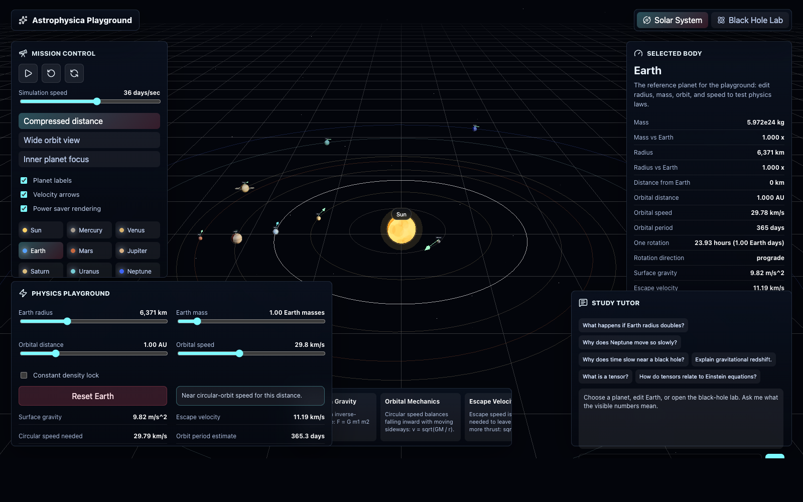

# Astrophysica Playground

A local interactive astrophysics study lab for exploring the Solar System, orbital mechanics, black holes, gravitational lensing, relativity, tensors, and AI-guided physics practice.

Astrophysica Playground is built as a premium visual playground: the first screen is the actual simulator, not a landing page. It includes a full Solar System scene, editable physics controls, real readouts, a cinematic black-hole lab, and a tutor panel that can use DeepSeek or any OpenAI-compatible chat-completions provider.



## Highlights

- Full Solar System: Sun, Mercury, Venus, Earth, Mars, Jupiter, Saturn, Uranus, and Neptune.
- Cinematic Three.js visuals with orbit trails, planet labels, atmosphere glows, Saturn rings, starfield, velocity vectors, and camera controls.
- Planet inspector with mass, radius, distance from Earth, orbital speed, orbital period, rotation, gravity, and escape velocity.
- Editable Earth playground for radius, mass, orbital distance, orbital speed, and density-lock experiments.
- Black-hole lab with a camera-facing cinematic render, visible accretion disk, photon ring, lensed back disk, redshift coloring, and bent light-ray paths.
- Relativity readouts for Schwarzschild radius, photon sphere, ISCO, time dilation, redshift, deflection angle, ship time, outside time, and length contraction.
- Study tutor panel for DeepSeek or OpenAI-compatible APIs.

## Gallery

### Solar System Playground



### Black-Hole And Relativity Lab


## Physics Covered

The playground is intentionally educational: it favors visible, controllable intuition over research-grade numerical simulation.

Newtonian mechanics:

```text
F = G m1 m2 / r^2
g = GM / R^2
v_circular = sqrt(GM / r)
v_escape = sqrt(2GM / R)
T = 2 pi sqrt(a^3 / GM)
KE = 1/2 mv^2
U = -GMm / r
```

Schwarzschild relativity:

```text
Rs = 2GM / c^2
photon sphere = 1.5 Rs
ISCO = 3 Rs
d_tau / dt = sqrt(1 - Rs / r)
weak light deflection alpha ~= 4GM / (c^2 b)
```

## Quick Start

```bash
cp .env.example .env
npm install
npm run dev
```

Open:

```text
http://127.0.0.1:5179
```

The API runs on:

```text
http://127.0.0.1:4279
```

## AI Tutor Setup

The app works without an API key. The tutor panel shows a clean setup message until an API key is configured.

Add this to `.env`:

```bash
LLM_API_KEY=your_key_here
LLM_API_URL=https://api.deepseek.com/chat/completions
LLM_MODEL=deepseek-chat
```

Then restart the dev server.

## Scripts

```bash
npm run dev        # API + Vite client
npm run build      # production frontend build
npm run start      # build and serve through the API server
npm run typecheck  # TypeScript verification
npm test           # physics formula tests
```

## Tech Stack

- TypeScript
- React
- Three.js and React Three Fiber
- Vite
- Express
- Vitest
- DeepSeek/OpenAI-compatible chat-completions API

## Scope

This first version uses curated real Solar System constants and educational approximations. It is meant for study, intuition, and interactive exploration. Future upgrades can add JPL Horizons/SPICE ephemerides, REBOUND N-body simulation, Kerr black holes, ray-marched lensing shaders, and symbolic tensor engines.
